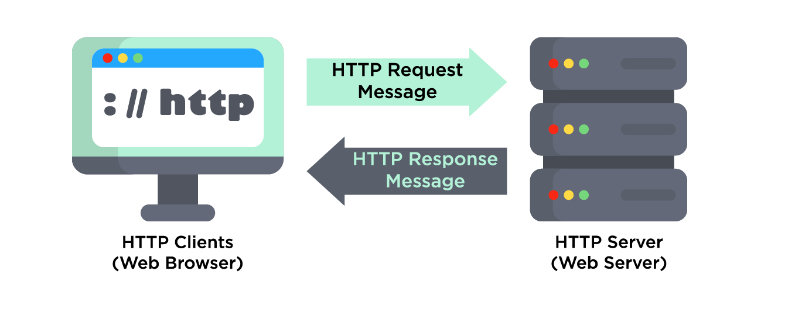
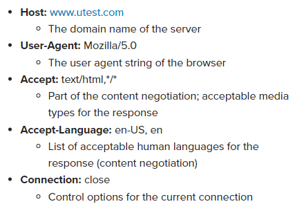
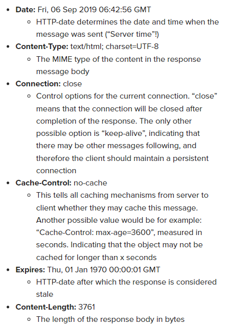

# What is an API?

__API__ stands for __Application Programming Interface__, which is a computing interface that __allows communication between two applications__.

API acts as an intermediary between a device and a server:
- The __user device__ requests some data, and then the request is sent to the __server__ via an API.
- The __server__ then retrieves that data, interprets it, performs the necessary actions, and sends it back to the __user device__ via an API.

### Note: API testing differs from regular testing or bug hunts:
- You will not be using a web browser or mobile device for testing.
- You will use specialized client applications like __Postman__, where all requests to the customer’s server are sent by you directly, and not from a web page.

# HTTP Basics

__Hypertext Transfer Protocol (HTTP)__ is the foundation of data communication for the World Wide Web.

The __client__ submits an __HTTP request__ message to the server. The __server__ returns a __HTTP response__ message to the __client__.

### Type of HTTP Requests:
- __GET__: Get some information
- __POST__: Upload something
- __PUT__: Update some information
- __DELETE__: Delete something
- __HEAD__: Get HTTP headers for a requests (get configurtion options information)
- __OPTIONS__: Get list of allowed HTTP requests

### HTTP Responses explain:
- __1XX__: Informational responses.
- __2XX__: Successful responses.
- __3XX__: Redirection messages.
- __4XX__: Client error responses.
- __5XX__: Server error responses.

__Most common HTTP Response codes:__

`200 OK` - The request succeeded.

`204 No Content` - The request succeeded but there is no content to send for this request.

`400 Bad Request` - Missing data or invalid formatting of the request might cause the status code 400 to be sent.

`404 Not Found` - The request is valid, but the resource cannot be found on the server.

`500 Internal Server Error` - An unexpected issue happened to the server.

`502 Bad Gateway` - The server got an invalid response.

More at https://developer.mozilla.org/en-US/docs/Web/HTTP/Status

### Some more keyword we will meet when working with HTTP:
(Don't need to remember, see again when needed)
- __URL structure__: protocol://hostname:port/path-and-resource-name.
- __Request Headers__: contains operating parameters of HTTP transmission.

- __Response Headers__: 

- There are dozens of other possible request and response headers. Many of them are self-explanatory, others must be looked up.

- __Query strings__: a way to transmit data to a web server in HTTP requests.

- __Content-type header__: information about content type of the data in HTTP transmission.

# API Testing with Postman
__Postman__ (getpostman.com) is a widely used tool for __API Testing__.

With __Postman__, we can create HTTP Requests and send them to other website's server.

We can also create Collections of Requests and handle Authorization while sending HTTP Requests with Postman.

Other tools for API Testing: SoapUI, GraphQL, Swagger UI,...

# Types of API and API Architecture
__Types of API:__
- __Public API__: API that can be used by anybody on the Internet.
- __Private API__: API that can only be used internally within the company.
- __Partner API__: API that can be used internally within the company and partners.
- __Composite API__: combines different types of API for specific uses.

__Types of API Architecture:__
- __REST API__: most popular API architecture on the Internet.
- __SOAP API__, __RPC API__: other API architectures which are designed for specific uses (Example: SOAP provides more secure APIs, RPC provides APIs that contain data in specific format like XML or JSON).